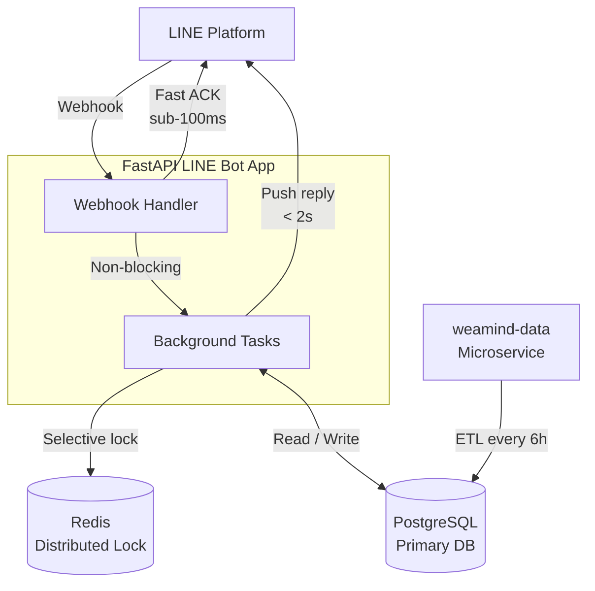

# WeaMind

> 📖 [中文版](README.md)

A production-grade LINE chatbot for real-time Taiwan weather queries, built with FastAPI.

> Kubernetes deployment: [weamind-infra](https://github.com/kyomind/weamind-infra)

## Features

- **Smart Text Search** — Type any district name (e.g. `大安區`, `中壢`) and get instant results; no menus needed.
- **Saved Locations** — Set a home and work address for one-tap weather lookups.
- **Recent Queries** — Quickly revisit any of your last 5 searched locations.
- **Map Query** — Tap anywhere on a map to check the weather — not just your current location.

---

## Engineering Highlights

### Fast ACK Webhook Architecture
- **Sub-50ms acknowledgement** (measured ~15–30ms in production): validates and responds to LINE Platform immediately on receipt, preventing platform-side retries.
- **End-to-end reply under 2 seconds**: request flows through fast ACK → background task → push reply.
- **Non-blocking design**: all business logic runs in FastAPI `BackgroundTasks`, keeping the webhook handler free.

### Redis Distributed Lock
- **2-second deduplication window**: drops repeated processing from rapid button taps.
- **Graceful degradation**: core functionality stays available when Redis is down.
- **Selective locking**: locks apply only to button actions; free-text queries are never blocked.

### Domain-Driven Design (DDD) Architecture
- **Four domain modules**: `core` (infrastructure), `user`, `line` (LINE Bot), `weather` — each with a clear bounded context.
- **Layered structure**: every module follows a `router → service → model` pattern, maintaining clean separation of concerns.

### Test Suite
- **94% code coverage** across 32+ test files spanning all domain modules.
- **Fully isolated tests**: each test gets a fresh in-memory SQLite database via pytest fixtures — no shared state.
- **Codecov on every PR**: coverage diffs are reported automatically, catching regressions before merge.

### Modern Toolchain
- **uv**: one tool for packages and virtual environments; everything runs via `uv run`.
- **Ruff**: a single tool replacing Pylint, Black, and isort.
- **Pyright**: strict static type checking with 100% type hint coverage.
- **pre-commit hooks**: linting and formatting enforced at commit time.
- **Security scanning**: Bandit, pip-audit, and detect-secrets cover static analysis, CVE checks, and secret detection.

### CI Pipeline
- **Full quality gate on every push**: Ruff → Pyright → Bandit → pip-audit → pytest + Codecov.
- **Multi-arch Docker builds**: `amd64` and `arm64` images pushed to GHCR on CI success.
- **Triple security scanning**: main CI pipeline + CodeQL + SonarCloud.
- **Automated releases**: follows [Semantic Versioning](https://semver.org/); tags trigger releases with auto-generated notes.

---

Further reading:
- [DeepWiki Technical Docs](https://deepwiki.com/kyomind/WeaMind)
