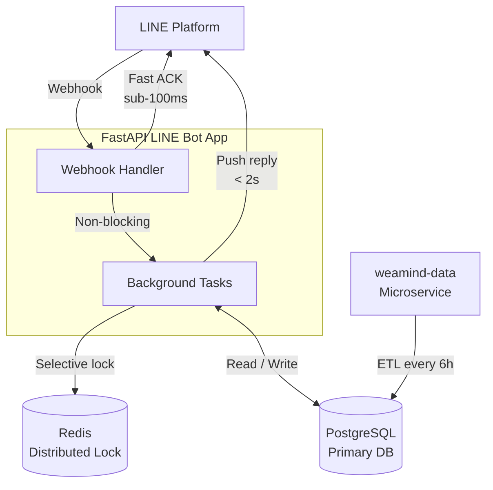

# WeaMind

> 📖 [中文版](README.md)

A production-grade LINE Bot delivering real-time Taiwan weather data via an intelligently designed FastAPI backend.

> Kubernetes deployment: [weamind-infra](https://github.com/kyomind/weamind-infra)

## Features

- **Smart Text Search** — Query any district by name (e.g. `大安區`, `中壢`); the system resolves the location automatically.
- **Saved Locations** — Pre-configure home and work addresses for one-tap weather lookups.
- **Recent Queries** — Instantly re-query any of the last 5 searched locations.
- **Map Query** — Pick any point on a map to retrieve its weather, not limited to current location.

---

## Engineering Highlights

### Fast ACK Webhook Architecture
- **Sub-50ms acknowledgement**: The webhook handler immediately validates and acknowledges LINE Platform upon receiving a request, preventing platform-side retries.
- **Under-2-second end-to-end reply**: Fast ACK → background processing → user response, all within 2 seconds.
- **Non-blocking design**: Business logic is handled via FastAPI `BackgroundTasks`, completely decoupled from the webhook response path.

### Redis Distributed Lock
- **2-second idempotency window**: Prevents duplicate processing caused by rapid repeated button taps.
- **Graceful degradation**: Core service continues to operate normally when Redis is unavailable.
- **Selective locking**: Applied only to button interactions; text queries are unaffected.

### Domain-Driven Design (DDD) Architecture
- **Domain modules**: `core` (infrastructure), `user` (user management), `line` (LINE Bot), `weather` (weather service).
- **Layered structure**: Each domain module contains `router.py`, `service.py`, and `models.py`, enforcing a clear three-layer separation.

### Test Suite
- **94% code coverage**: 32+ test files covering all domain modules — `core`, `line`, `weather`, and `user`.
- **Isolated test environment**: In-memory SQLite + pytest fixtures; each test runs independently with no shared state.
- **Codecov integration**: Every PR triggers an automated coverage diff report, guarding against regressions.

### Modern Toolchain
- **uv**: Unified Python package and virtual environment management; all commands run via `uv run`.
- **Ruff**: Replaces Pylint, Black, and isort as the single linting and formatting tool.
- **Pyright**: 100% type hint coverage enforced via static type checking.
- **pre-commit hooks**: Formatting and linting checks run automatically before every commit.
- **Security scanning**: Bandit (static analysis), pip-audit (CVE checks), detect-secrets (secret detection).

### CI Pipeline
- **Automated quality gate**: Every push runs Ruff → Pyright → Bandit → pip-audit → pytest + Codecov in sequence.
- **Multi-arch image build**: On CI success, Docker images are built for `amd64`/`arm64` and pushed to GHCR.
- **Triple security scanning**: Main CI + CodeQL (code security analysis) + SonarCloud (technical debt monitoring).
- **Automated releases**: Follows [Semantic Versioning](https://semver.org/); Git tags trigger version releases with auto-generated release notes.

---

Further reading:
- [DeepWiki Technical Docs](https://deepwiki.com/kyomind/WeaMind)
