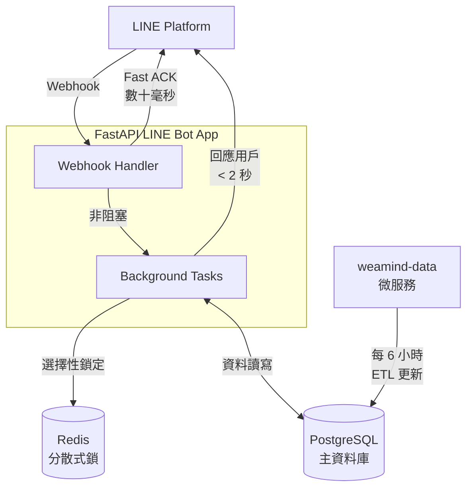

A smart LINE bot for Taiwan weather updates. See [DeepWiki](https://deepwiki.com/kyomind/WeaMind) for details.

WeaMind 是一個智慧天氣 LINE Bot，透過簡單的操作或文字查詢，提供即時台灣天氣資訊。

本服務完全**免費**，如果對你有幫助，歡迎[贊助我一杯咖啡](https://portaly.cc/kyomind/support)，或點擊右上角的 ⭐️ 支持我。

## 使用說明

加入 WeaMind 為好友後，點擊聊天視窗下方的「功能選單」即可開始使用。

### 1. 智慧文字搜尋
- 直接輸入「二級行政區」名稱，比如「`大安區`」、「`水上`」、「`中壢`」等，將進行地名的模糊比對。
- 系統會自動識別並回傳該地區的天氣資訊。

### 2. 設定住家、公司，一鍵查詢天氣
- 透過「`設定地點`」功能，預先設定常用地址。
- 點擊「`查住家`」或「`查公司`」立即取得該地區的完整天氣資訊。

### 3. 快速重複查詢
- 「`最近查過`」會記錄您最近查詢過的 **5 個地點**（不含住家與公司）。
- 點擊後重新查詢，無需重複輸入地址。

### 4. 地圖查詢
- 點擊「`地圖查詢`」會開啟 LINE 地圖介面。
- 直接在地圖上選擇位置，系統會自動取得該地點資訊並查詢當地天氣。
- 不限於目前所在位置，你可以查詢**任意地點**的天氣。

## 加入好友，開始使用

1. 掃描下方 QR Code（推薦）或搜尋 LINE ID `@370ndhmf` 加入 WeaMind。
2. 使用功能選單開始查詢天氣資訊。

立即體驗智慧天氣查詢，讓天氣資訊隨手可得！

---

## 開發者技術亮點

### 🚀 Fast ACK Webhook 架構
- **數十毫秒 ACK**：Webhook Handler 收到請求後立即驗證並回應 LINE Platform，避免平台重送
- **2 秒內回應用戶**：採用「快速 ACK→背景處理→回應用戶」的非同步流程
- **背景任務處理**：使用 FastAPI BackgroundTasks，避免業務邏輯阻塞 ACK

### 🔒 Redis 分散式鎖
- **防重複點擊保護**：2 秒鎖定機制，避免用戶快速連點造成重複處理
- **服務優先策略**：Redis 異常時自動降級，確保核心服務不中斷
- **精準鎖定範圍**：僅對按鈕操作加鎖，一般文字查詢保持快速回應

### 🏗️ Domain-Driven Design 架構
- **清晰領域邊界**：`core`（基礎設施）、`user`（使用者管理）、`line`（LINE Bot）、`weather`（天氣服務）
- **分層模組化設計**：按業務領域劃分模組，架構清晰易擴展，適合團隊協作開發
- **100% Type Hints 覆蓋**：以 Pyright basic 標準，達成完整型別安全

### 🧪 pytest 單元測試體系
- **94% 測試覆蓋率**：高覆蓋率確保程式碼品質與穩定性
- **32+ 測試檔案**：涵蓋 core、line、weather、user 各領域模組的完整測試
- **測試環境隔離**：SQLite 記憶體資料庫 + fixtures 設計，確保測試獨立性
- **自動化覆蓋率**：pytest-cov 整合，自動生成覆蓋率報告並上傳 Codecov

### 🛠️ 現代化開發工具鏈
- **統一環境管理**：uv 套件管理，統一 `uv run` 指令執行，消除環境差異
- **完整程式碼品質檢查**：Ruff 靜態檢查與格式化，確保程式碼一致性
- **自動化程式碼檢查**：pre-commit hooks 於 commit 前自動執行品質檢查
- **多重安全掃描**：Bandit（靜態安全）、pip-audit（CVE 檢查）、detect-secrets（敏感資料防護）

### 🔄 完整 CI Pipeline
- **多層級程式碼品質檢查**：Ruff → Pyright → Bandit → pip-audit → pytest 依序執行
- **容器化驗證**：每次 PR 自動驗證 Docker image 完整性
- **三軌安全分析**：主 CI 流程 + CodeQL + SonarCloud 多維度安全與品質監控
- **自動化發布**：Git tag 觸發自動版本發布與 release notes 生成

### 📦 容器化與部署
- **多層快取 Docker 設計**：分層快取機制（依賴層 + 應用層），大幅加速重建時間
- **自動化部署流程**：Makefile 整合資料庫健康檢查、自動遷移、錯誤處理的完整部署機制
- **多環境配置繼承**：dev/prod 環境透過 Docker Compose 組合實現環境隔離與配置複用

---

詳細技術架構請參考：
- [專案架構](docs/Architecture-Code.md) - 完整程式碼架構說明
- [DeepWiki 技術文件](https://deepwiki.com/kyomind/WeaMind) - 互動式技術探索
