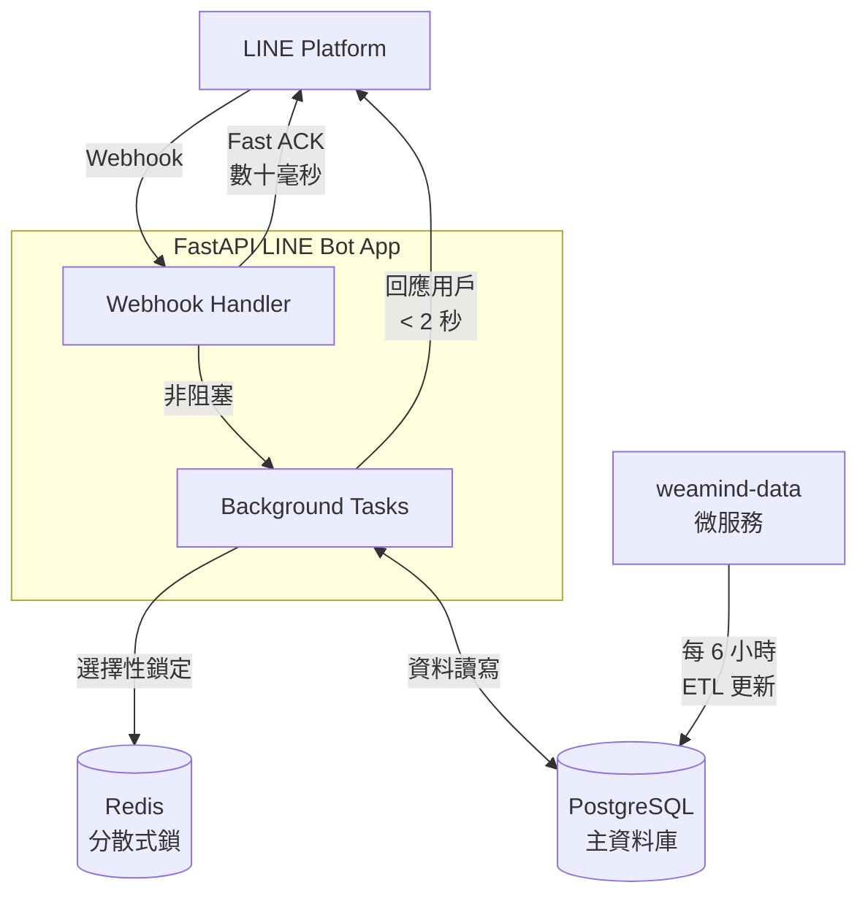

A smart LINE Bot for Taiwan weather updates.

> **WeaMind on Kubernetes**：[weamind-infra](https://github.com/kyomind/weamind-infra) - WeaMind 的 Kubernetes (K3s) 部署與架構

WeaMind 是一個智慧天氣 LINE Bot，透過簡單的操作或文字查詢，提供即時台灣天氣資訊。

本服務完全**免費**，如果對你有幫助，歡迎[贊助我一杯咖啡](https://portaly.cc/kyomind/support)，或點擊右上角的 ⭐️ 支持我。

## 快速導覽

- [使用說明](#使用說明)
  - [智慧文字搜尋](#1-智慧文字搜尋)
  - [設定住家、公司](#2-設定住家公司一鍵查詢天氣)
  - [快速重複查詢](#3-快速重複查詢)
  - [地圖查詢](#4-地圖查詢)
  - [加入好友](#加入好友開始使用)
- [開發者技術亮點](#開發者技術亮點)
  - [Fast ACK Webhook 架構](#-fast-ack-webhook-架構)
  - [Redis 分散式鎖](#-redis-分散式鎖)
  - [Domain-Driven Design 架構](#-domain-driven-design-架構)
  - [pytest 單元測試體系](#-pytest-單元測試體系)
  - [現代化開發工具鏈](#-現代化開發工具鏈)
  - [完整 CI Pipeline](#-完整-ci-pipeline)
  - [容器化與部署](#-容器化與部署)

## 使用說明

加入 WeaMind 為好友後，點擊聊天視窗下方的「功能選單」即可開始使用。

### 1. 智慧文字搜尋
- 直接輸入「二級行政區」名稱，例如「`大安區`」、「`水上`」、「`中壢`」，就能快速查詢。
- 系統會自動識別地點並回傳天氣資訊。

### 2. 設定住家、公司，一鍵查詢天氣
- 透過「`設定地點`」功能，預先設定常用地址。
- 點擊「`查住家`」或「`查公司`」即可立即查詢天氣。

### 3. 快速重複查詢
- 「`最近查過`」會記錄您最近查詢的 **5 個地點**（不含住家與公司）。
- 點擊即可重新查詢，無需重複輸入。

### 4. 地圖查詢
- 點擊「`地圖查詢`」開啟 LINE 地圖介面。
- 在地圖上選擇任意位置，系統會自動查詢該地點的天氣。
- 不限於目前所在位置，可查詢**任何地點**的天氣。

## 加入好友，開始使用

1. 掃描下方 QR Code（推薦）或搜尋 LINE ID `@370ndhmf` 加入 WeaMind。
2. 點擊功能選單即可開始查詢。

立即體驗智慧天氣查詢！

---

## 開發者技術亮點

```mermaid
graph TB
    LINE[LINE Platform]
    REDIS[(Redis<br/>分散式鎖)]
    DB[(PostgreSQL<br/>主資料庫)]
    DATA[weamind-data<br/>微服務]

    subgraph FASTAPI["FastAPI LINE Bot App"]
        WEB[Webhook Handler]
        BG[Background Tasks]
    end

    LINE -->|Webhook| WEB
    WEB -->|Fast ACK<br/>數十毫秒| LINE
    WEB -->|非阻塞| BG
    BG -->|選擇性鎖定| REDIS
    BG <-->|資料讀寫| DB
        BG -->|回應用戶<br/>< 2 秒| LINE
    DATA -->|每 6 小時<br/>ETL 更新| DB
```

### Fast ACK Webhook 架構
- **數十毫秒 ACK**：Webhook Handler 收到請求後立即驗證並回應 LINE Platform，避免平台重送
- **2 秒內回應**：快速 ACK → 背景處理 → 回應用戶
- **非阻塞設計**：使用 FastAPI `BackgroundTasks` 處理業務邏輯，不阻塞 webhook 回應

### Redis 分散式鎖
- **2 秒鎖定機制**：避免用戶快速連點造成重複處理
- **異常降級策略**：Redis 異常時核心服務繼續運作
- **選擇性加鎖**：僅對按鈕操作加鎖，文字查詢不受影響

### Domain-Driven Design 架構
- **領域模組劃分**：`core`（基礎設施）、`user`（使用者管理）、`line`（LINE Bot）、`weather`（天氣服務）
- **分層架構實踐**：每個領域模組包含 `router.py`、`service.py`、`models.py` 實現三層分離

### pytest 單元測試體系
- **94% 測試覆蓋率**：32+ 測試檔案涵蓋 core、line、weather、user 各模組
- **獨立測試環境**：SQLite 記憶體資料庫 + fixtures，每個測試獨立運行不互相干擾
- **Codecov 監控**：每次 PR 自動檢查覆蓋率變化，防止新功能降低測試覆蓋率

### 🛠️ 現代化開發工具鏈
- **統一環境管理**：uv 套件管理，統一 `uv run` 指令執行，消除環境差異
- **完整程式碼品質檢查**：Ruff 靜態檢查與格式化，確保程式碼一致性
- **自動化程式碼檢查**：pre-commit hooks 於 commit 前自動執行品質檢查
- **多重安全掃描**：Bandit（靜態安全）、pip-audit（CVE 檢查）、detect-secrets（敏感資料防護）

### 🔄 完整 CI Pipeline
- **多層級程式碼品質檢查**：Ruff → Pyright → Bandit → pip-audit → pytest 依序執行
- **容器化驗證**：每次 PR 自動驗證 Docker image 完整性
- **三軌安全分析**：主 CI 流程 + CodeQL + SonarCloud 多維度安全與品質監控
- **自動化發布**：Git tag 觸發自動版本發布與 release notes 生成

### 📦 容器化與部署
- **多層快取 Docker 設計**：分層快取機制（依賴層 + 應用層），大幅加速重建時間
- **自動化部署流程**：Makefile 整合資料庫健康檢查、自動遷移、錯誤處理的完整部署機制
- **多環境配置繼承**：dev/prod 環境透過 Docker Compose 組合實現環境隔離與配置複用

---

詳細技術架構與決策邏輯請參考：
- [技術決策與實踐經驗](#) - 為什麼這樣設計、踩坑紀錄（撰寫中）
- [專案架構](docs/Architecture-Code.md) - 完整程式碼架構說明
- [DeepWiki 技術文件](https://deepwiki.com/kyomind/WeaMind) - 互動式技術探索
