A smart LINE bot for Taiwan weather updates. See [DeepWiki](https://deepwiki.com/kyomind/WeaMind) for details.

WeaMind 是一個智慧天氣 LINE Bot，透過簡單的操作或文字查詢，提供即時台灣天氣資訊。

本服務完全**免費**，如果對你有幫助，歡迎[贊助我一杯咖啡](https://portaly.cc/kyomind/support)，或點擊右上角的 ⭐️ 支持我。

## 使用說明

加入 WeaMind 為好友後，點擊聊天視窗下方的「功能選單」即可開始使用。

### 1. 智慧文字搜尋
- 直接輸入「二級行政區」名稱，比如「`大安區`」、「`水上`」、「`中壢`」等，將進行地名的模糊比對。
- 系統會自動識別並回傳該地區的天氣資訊。

### 2. 設定住家、公司，一鍵查詢天氣
- 透過「`設定地點`」功能，預先設定常用地址。
- 點擊「`查住家`」或「`查公司`」立即取得該地區的完整天氣資訊。

### 3. 快速重複查詢
- 「`最近查過`」會記錄您最近查詢過的 **5 個地點**（不含住家與公司）。
- 點擊後重新查詢，無需重複輸入地址。

### 4. 地圖查詢
- 點擊「`地圖查詢`」會開啟 LINE 地圖介面。
- 直接在地圖上選擇位置，系統會自動取得該地點資訊並查詢當地天氣。
- 不限於目前所在位置，你可以查詢**任意地點**的天氣。

## 加入好友，開始使用

1. 掃描下方 QR Code（推薦）或搜尋 LINE ID `@370ndhmf` 加入 WeaMind。
2. 使用功能選單開始查詢天氣資訊。

立即體驗智慧天氣查詢，讓天氣資訊隨手可得！

## 開發者技術亮點

```mermaid
graph TB
    LINE[LINE Platform]
    REDIS[(Redis<br/>分散式鎖)]
    DB[(PostgreSQL<br/>主資料庫)]
    DATA[weamind-data<br/>微服務]

    subgraph FASTAPI["FastAPI LINE Bot App"]
        WEB[Webhook Handler]
        BG[Background Tasks]
    end

    LINE -->|Webhook| WEB
    WEB -->|Fast ACK<br/>數十毫秒| LINE
    WEB -->|非阻塞| BG
    BG -->|選擇性鎖定| REDIS
    BG <-->|資料讀寫| DB
        BG -->|回應用戶<br/>< 3 秒| LINE
    DATA -->|每 6 小時<br/>ETL 更新| DB
```

### 🚀 Fast ACK Webhook 架構
- **數十毫秒 ACK**：Webhook Handler 收到請求後立即驗證並回應，避免平台重送
- **3 秒內回應用戶**：採用「快速 ACK→背景處理→回應用戶」的非同步流程
- **背景任務處理**：使用 FastAPI BackgroundTasks，避免業務邏輯阻塞 ACK
- **錯誤隔離**：後台例外不影響 webhook 成功回應，防止 LINE 平台重送

### 🔒 Redis 分散式並行控制
- **固定 TTL 設計**：2 秒自動釋放鎖，簡化實作並防護快速點擊
- **Fail-Open 策略**：Redis 服務異常時允許請求通過，優先保證服務可用性
- **選擇性鎖定**：僅對 Rich Menu PostBack 等高風險操作加鎖，文字輸入無鎖

### 🗺️ 智慧位置解析引擎
- **四層搜尋策略**：精確匹配 → 縣市匹配 → 鄉鎮市區匹配 → 模糊匹配
- **地址優先 + GPS 備援**：LINE GPS 分享時優先解析地址，失敗才用座標計算最近位置
- **台灣行政區劃完整支援**：縣市、鄉鎮市區二級行政區劃驗證與正規化
- **智慧回饋機制**：根據搜尋結果數量（0/1/2-3/>3）提供不同使用者引導

### 🏗️ Domain-Driven Design 架構
- **清晰領域邊界**：`core`（基礎設施）、`user`（使用者管理）、`line`（LINE Bot）、`weather`（天氣服務）
- **依賴反轉**：FastAPI 依賴注入機制，便於測試與模組替換
- **型別安全設計**：全專案 type hints 覆蓋，Pyright 靜態檢查

### 🧪 pytest 單元測試體系
- **完整測試覆蓋**：32+ 測試檔案涵蓋 core、line、weather、user 各領域模組
- **測試環境隔離**：SQLite 記憶體資料庫 + fixtures 設計，確保測試獨立性
- **非同步測試支援**：pytest-asyncio 完美適配 FastAPI 非同步特性
- **自動化覆蓋率**：pytest-cov 整合，自動生成覆蓋率報告並上傳 Codecov

### 🛠️ 現代化開發工具鏈
- **uv 套件管理**：替代 pip + venv，統一 `uv run` 指令執行
- **Ruff 靜態檢查與格式化**：整合 linting + formatting，取代 black + isort + flake8
- **pre-commit hooks**：透過 pre-commit 工具設定 Git hooks，於 commit 前自動執行程式碼檢查
- **多重安全掃描**：Bandit（靜態安全）、pip-audit（CVE 檢查）、detect-secrets（敏感資料防護）

### 🔄 完整 CI Pipeline
- **雙軌 GitHub Actions**：主 CI 流程 + CodeQL 安全分析
- **容器化驗證**：每次 PR 自動驗證 Docker image 完整性
- **多層級程式碼品質檢查**：Ruff → Pyright → Bandit → pip-audit → pytest 依序執行
- **自動化發布**：Git tag 觸發自動版本發布與 release notes 生成
- **Dependabot 整合**：每週自動檢查 Python 套件與 GitHub Actions 安全更新
- **Codecov 整合**：測試覆蓋率自動上傳與 PR 報告
- **SonarCloud 靜態分析**：持續監控程式碼品質，提供安全性與技術債務報告

### 📦 容器化與部署
- **多環境 Docker Compose**：開發、測試、生產環境設定繼承
- **Alembic 資料庫遷移**：版本化 schema 管理，支援向前向後遷移
- **健康檢查機制**：容器與應用程式層級的多重健康監控

---

詳細技術架構請參考：
- [專案架構](docs/Architecture-Code.md) - 完整程式碼架構說明
- [DeepWiki 技術文件](https://deepwiki.com/kyomind/WeaMind) - 互動式技術探索
