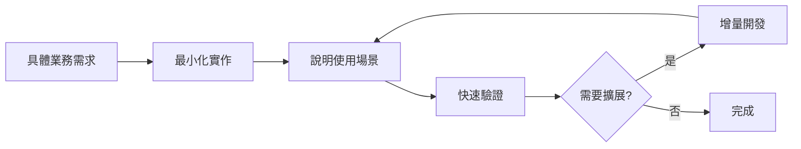

# DISCUSS - AI 開發中的無效代碼預防策略探討

## 📋 討論概述

**討論日期**: 2025年8月19日  
**參與者**: 開發者 & GitHub Copilot  
**觸發事件**: 發現 User API 安全性優化過程中存在大量無效代碼  
**核心議題**: 如何在 AI 輔助開發環境下預防和發現無效代碼問題

## 🔍 問題背景與發現

### 具體案例
在 `feature/user-api-security-optimization` 分支的實作過程中發現：

1. **4 個完全無用的 API 端點**：
   - `POST /users` - 創建用戶
   - `GET /users/{user_id}` - 查詢用戶  
   - `PATCH /users/{user_id}` - 更新用戶
   - `DELETE /users/{user_id}` - 刪除用戶

2. **對應的無效代碼**：
   - 4 個 Service 層函式
   - 3 個 Pydantic Schema
   - 7 個測試函式
   - 總計 **306 行無效代碼**

3. **業務分析結果**：
   - 這些函式在業務邏輯中**完全沒有被調用**
   - 只在測試中被使用，形成「**測試劇場**」現象
   - 實際業務流程完全通過 LINE Bot 事件處理

### 根本問題
> **AI 擅長寫技術上正確的代碼，但不善於判斷業務上是否需要這段代碼**

## 🎯 問題的系統性分析

### AI 開發的典型陷阱
1. **模式匹配陷阱**
   - 看到 User 模型 → 自動聯想需要完整 CRUD
   - 按照「最佳實踐」模板開發
   - 缺乏業務場景驗證

2. **過度工程化傾向**
   - 傾向於實作「完整」功能集
   - 預先實作「可能」需要的功能
   - 違反 YAGNI (You Aren't Gonna Need It) 原則

3. **測試驅動的假象**
   - 有測試 ≠ 有價值
   - 高覆蓋率掩蓋無效代碼問題
   - 「測試劇場」現象嚴重

### 造成的影響
- ❌ 浪費開發時間
- ❌ 增加維護成本
- ❌ 產生安全風險（暴露不必要的 API）
- ❌ 造成代碼膨脹
- ❌ 測試覆蓋率虛高

## 💡 討論的解決方案

### 方案比較：事前預防 vs 事後檢查

#### 事前預防 ⭐ (推薦)
**優點**:
- 從源頭避免問題
- 可內建在開發流程中
- 不依賴人主動執行

**方法**:
1. **需求描述具體化**
2. **增量開發指令**  
3. **要求說明使用場景**

#### 事後檢查 (輔助)
**優點**:
- 不影響開發流程
- 可批量檢查問題

**限制**:
- 依賴人主動執行
- 問題已經產生

### 自動化檢測工具探討

#### 嘗試的靜態分析方法
建立了基於 AST 的未使用代碼檢測工具，但發現重大限制：

1. **無法理解裝飾器語義**
   ```python
   @webhook_handler.add(MessageEvent)  # 實際註冊了函式
   def handle_message_event(...): pass  # 但 AST 看不到調用關係
   ```

2. **無法檢測框架調用**
   - FastAPI 路由函式
   - LINE SDK 事件處理
   - 任何動態/反射調用

3. **誤判案例**
   - `handle_follow_event` 等函式被誤判為「只在測試中使用」
   - 實際上這些函式被 LINE SDK 通過裝飾器調用

#### 結論
> **靜態分析工具容易誤判，不適合作為主要檢測手段**

## 🎯 達成的共識與建議

### 核心原則
1. **業務驅動開發** > 技術驅動開發
2. **事前預防** > 事後檢查  
3. **最小化實作** > 完整功能集
4. **具體場景** > 抽象需求

### 實用的預防策略

#### 1. 改進 AI 指令方式
```markdown
❌ 錯誤指令：「實作用戶管理功能」
✅ 正確指令：「實作 LINE Bot follow 事件處理，當用戶 follow 時自動創建用戶記錄」
```

#### 2. 增量開發原則
```markdown
對 AI 明確說明：
"先實作最基本的功能，如果我需要其他功能會再告訴你。
不要預先實作可能用到的功能。"
```

#### 3. 強制業務驗證
```markdown
要求 AI 完成開發後說明：
1. 這個 API 會被誰調用？
2. 在什麼情況下調用？
3. 如果沒有這個功能會怎樣？
```

### 簡化檢查方法：3-2-1 檢查法

#### 3 秒檢查：看 PR 標題
```
✅ "實作 LINE Bot follow 事件處理"
❌ "實作用戶 CRUD 功能"  
```

#### 2 分鐘檢查：看文件變化量
```bash
git diff --stat

# 危險信號：
# - router.py +50 -0     (新增太多路由)
# - test_*.py +100 -0    (測試代碼過多)
```

#### 1 個問題：問業務價值
```
"這些新增的 API，現在馬上會有人調用嗎？"
如果答案是 "可能以後會用到"，就有問題。
```

### 視覺化危險信號
```markdown
🚨 一次新增 4+ 個類似名字的函式 (create/read/update/delete_*)
🚨 測試文件變化量 > 業務代碼變化量  
🚨 新增的 API 路由沒有對應的調用方
```

## 🔧 實作建議

### 給 AI 的固定提示模板
```markdown
開發指導原則：
1. 只實作當前明確需要的功能
2. 每個 API 端點都要有具體的調用者
3. 優先實作業務邏輯，後續再考慮管理功能  
4. 如果不確定是否需要某個功能，先不要實作

請在開發完成後說明：
- 這個功能解決了什麼具體問題？
- 誰會在什麼時候調用這些 API？
```

### 開發流程改進


## ❓ 尚未解決的問題

### 1. 動態調用檢測
**問題**: 如何自動檢測通過裝飾器、反射等方式調用的函式？
**影響**: 可能誤判框架相關的函式為無用代碼

### 2. 業務邏輯自動驗證  
**問題**: 如何讓工具理解業務邏輯，而非僅做語法分析？
**挑戰**: 需要結合領域知識和代碼分析

### 3. AI 行為模式改進
**問題**: 如何從根本上改變 AI 的「完整實作」慣性？
**需要**: 更好的提示工程和 AI 訓練方法

### 4. 團隊協作規範
**問題**: 如何在團隊中推廣這些實踐？
**考慮**: 需要制定明確的代碼審查標準

## 🚀 後續思考方向

### 短期實作 (1-2 週)
1. **建立 AI 提示模板庫**
   - 收集各種場景的正確提示方式
   - 避免觸發 AI 過度工程化

2. **制定簡化檢查清單**
   - 整合到現有 PR 流程
   - 重點關注危險信號識別

### 中期研究 (1-2 月)
1. **業務邏輯分析工具**
   - 結合靜態分析和業務規則
   - 提供更準確的未使用代碼檢測

2. **開發模式最佳實踐**
   - 總結不同場景下的有效開發模式
   - 建立 AI 協作指導原則

### 長期探索 (3-6 月)  
1. **智能代碼審查系統**
   - 結合 AI 理解業務邏輯
   - 自動識別無效代碼模式

2. **開發效率評估機制**
   - 量化無效代碼對項目的影響
   - 建立代碼品質度量標準

## 📚 相關資源

### 參考文件
- [User API 安全性優化實作紀錄](./DONE-User-API-Security-Optimization-Implementation-Record.md)
- [專案架構文件](./Architecture.md)

### 外部參考
- [YAGNI 原則](https://en.wikipedia.org/wiki/You_aren%27t_gonna_need_it)
- [Testing Theater 概念](https://www.thoughtworks.com/insights/blog/what-testing-theater)
- [Code Smells 識別](https://refactoring.guru/refactoring/smells)

## 💭 反思與學習

### 關鍵洞察
1. **測試覆蓋率不等於代碼價值** - 高覆蓋率可能掩蓋嚴重問題
2. **AI 需要業務上下文** - 純技術指令容易導致過度工程化  
3. **簡單檢查更可行** - 複雜的自動化工具容易誤判

### 最重要的發現
> **最安全的代碼就是不存在的代碼**  
> **最有效的預防方法是從需求描述開始就保持業務導向**

### 對未來開發的啟示
這次討論揭示了 AI 輔助開發中的一個根本挑戰：如何在保持開發效率的同時，確保所產生的代碼都有實際業務價值。這不僅是技術問題，更是開發方法論的問題。

---

**文件版本**: v1.0  
**最後更新**: 2025年8月19日  
**狀態**: 🔄 持續討論中  
**下次檢討**: 實作提示模板庫後進行效果評估
