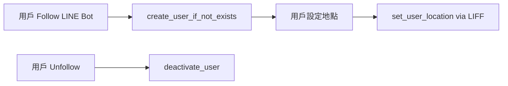

# DONE - 用戶 API 安全性優化實作紀錄

## 📋 專案概述

**實作日期**: 2025年8月19日  
**分支名稱**: `feature/user-api-security-optimization`  
**主要目標**: 消除用戶 API 的重大安全漏洞，建立符合 LINE Bot 生態系統的安全架構  
**相關文件**: `docs/User-API-Security-Design-Discussion.md`

## 🔍 問題識別與分析

### 核心安全問題

1. **無認證的危險 API 端點**
   ```
   POST   /users              # 無認證的用戶創建
   GET    /users/{user_id}    # 無認證的用戶查詢 (IDOR 漏洞)
   PATCH  /users/{user_id}    # 無認證的用戶更新 (IDOR 漏洞) 
   DELETE /users/{user_id}    # 無認證的用戶刪除 (IDOR 漏洞)
   ```

2. **IDOR (Insecure Direct Object Reference) 漏洞**
   - 使用自增整數 ID (1, 2, 3, 4...) 作為 API 參數
   - 攻擊者可以遍歷所有用戶資料
   - 完全沒有認證保護機制

3. **違反最小權限原則**
   - 暴露了不必要的 CRUD 操作
   - 與 LINE Bot 實際使用場景不符

## 🎯 技術決策與設計原則

### 設計原則選擇

**採用方案**: 移除不必要的公開 API ⭐  
**原因**: 遵循 "安全的核心不是加更多認證，而是不暴露不需要的功能" 的原則

**替代方案分析**:
- ❌ 為所有 API 加入認證 - 違反 YAGNI 原則，增加不必要複雜度
- ❌ 區分內部/外部 API - 對當前需求過度工程

### 架構決策

1. **雙 ID 設計模式** (已存在，驗證保留)
   ```python
   class User(Base):
       id: Mapped[int] = mapped_column(Integer, primary_key=True)           # 內部高效查詢
       line_user_id: Mapped[str] = mapped_column(String, unique=True)       # 對外安全識別
   ```

2. **API 最小化原則**
   - 只保留真正需要的對外 API
   - 內部邏輯完全通過 Service 層處理

## 🛠 實作過程

### 階段 1: API 端點移除

#### 移除的危險端點
```python
# 移除前 (app/user/router.py)
@router.post("", status_code=status.HTTP_201_CREATED)
async def create_user(payload: UserCreate, session: Session) -> UserRead
    
@router.get("/{user_id}")  
async def get_user(user_id: int, session: Session) -> UserRead

@router.patch("/{user_id}")
async def update_user(user_id: int, payload: UserUpdate, session: Session) -> UserRead

@router.delete("/{user_id}", status_code=status.HTTP_204_NO_CONTENT)
async def delete_user(user_id: int, session: Session) -> None
```

#### 保留的安全端點
```python
# 保留 (app/user/router.py)
@router.post("/locations")
async def set_user_location(
    payload: LocationSettingRequest,
    line_user_id: Annotated[str, Depends(get_current_line_user_id_from_access_token)],
    session: Annotated[Session, Depends(get_session)],
) -> LocationSettingResponse
```

### 階段 2: 代碼清理與優化

#### 業務邏輯使用情況分析
通過 `list_code_usages` 工具分析發現：

**真正在業務中使用的函式** ✅:
- `create_user_if_not_exists()` - LINE webhook follow 事件
- `deactivate_user()` - LINE webhook unfollow 事件  
- `set_user_location()` - LIFF 地點設定 API
- `get_user_by_line_id()` - 透過 LINE ID 查詢用戶

**只在測試中使用的函式** ❌:
- `create_user()` - 移除
- `get_user()` - 移除
- `update_user()` - 移除  
- `delete_user()` - 移除

#### 移除不必要的 Service 函式
```python
# 移除前 (app/user/service.py)
def create_user(session: Session, user_in: UserCreate) -> User: ...
def get_user(session: Session, user_id: int) -> User | None: ...
def update_user(session: Session, user_id: int, user_in: UserUpdate) -> User | None: ...
def delete_user(session: Session, user_id: int) -> bool: ...

# 移除後 - 只保留真正使用的函式
def get_user_by_line_id(session: Session, line_user_id: str) -> User | None: ...
def create_user_if_not_exists(...) -> User: ...
def deactivate_user(session: Session, line_user_id: str) -> User | None: ...
def set_user_location(...) -> tuple[bool, str, User | None]: ...
```

#### Schema 清理
```python
# 移除前 (app/user/schemas.py)
class UserCreate(BaseModel): ...     # ❌ 移除
class UserRead(BaseModel): ...       # ❌ 移除  
class UserUpdate(BaseModel): ...     # ❌ 移除

# 移除後 - 只保留 LIFF 相關
class LocationSettingRequest(BaseModel): ...   # ✅ 保留
class LocationSettingResponse(BaseModel): ...  # ✅ 保留
```

#### 測試清理
移除對應的測試函式：
- `test_create_user()` 系列 - 7 個測試函式
- 保持測試覆蓋率 96%，測試數量從 87 降至 80

## 🏗 最終架構

### API 架構
```
🌐 公開 API (對外)
└── POST /users/locations  ← LIFF 地點設定 (LINE Token 認證)

🔒 內部 Service (不對外)  
├── create_user_if_not_exists()  ← LINE webhook 觸發
├── get_user_by_line_id()        ← 內部查詢使用
├── deactivate_user()            ← LINE webhook 觸發  
└── set_user_location()          ← LIFF API 內部邏輯
```

### 用戶生命週期管理


## 🧪 品質保證

### 測試結果
- ✅ **80/80 測試通過** (100%)
- ✅ **代碼覆蓋率 96%** 
- ✅ **Ruff Lint**: 無問題
- ✅ **Pyright 類型檢查**: 無錯誤

### 代碼統計
- **移除**: 311 行代碼
- **新增**: 5 行代碼  
- **淨移除**: 306 行代碼

### 檔案異動清單
```
app/user/router.py      | 62 +------  (移除 4 個 API 端點)
app/user/schemas.py     | 40 -----  (移除 3 個 schema)
app/user/service.py     | 50 ------  (移除 4 個函式)
docs/Todo.md            |  7 +-     (更新完成紀錄)
tests/user/test_user.py | 157 -------- (移除對應測試)
```

## 🔒 安全效益

### 消除的漏洞
1. **IDOR 漏洞完全消除** - 不再有通過 ID 直接存取的端點
2. **未授權存取風險歸零** - 所有對外 API 都有認證保護
3. **資料洩露風險大幅降低** - 最小化暴露面

### 安全改善對比
```
🔴 改善前
├── 4 個無認證 API 端點
├── 可遍歷所有用戶資料  
├── 可任意創建/修改/刪除用戶
└── IDOR 漏洞嚴重

🟢 改善後  
├── 1 個有認證的 API 端點
├── 無法直接存取用戶資料
├── 所有用戶操作透過 LINE Bot 控制
└── 符合最小權限原則
```

## 🎛 關鍵技術細節

### LINE Bot 認證機制
```python
# LIFF API 使用 LINE Access Token 認證
line_user_id: Annotated[str, Depends(get_current_line_user_id_from_access_token)]
```

### 用戶自動創建邏輯
```python
# LINE webhook follow 事件觸發
def create_user_if_not_exists(session: Session, line_user_id: str, display_name: str | None = None) -> User:
    # 檢查用戶是否存在
    # 如不存在則自動創建
    # 如存在但被停用則重新啟用
```

### 軟刪除機制
```python
# 用戶 unfollow 使用軟刪除，而非硬刪除
def deactivate_user(session: Session, line_user_id: str) -> User | None:
    # 設定 is_active = False，保留用戶資料
```

## 📚 維護指南

### 未來擴展考量
1. **如需新增用戶相關 API**
   - 必須先評估業務必要性
   - 必須加入適當的認證機制
   - 避免使用內部 ID 作為 API 參數

2. **內部管理工具開發**
   - 可以重新實作基本 CRUD 函式
   - 但僅供內部管理使用，不對外暴露

3. **審計機制**
   - 考慮為敏感操作加入審計日誌
   - 監控異常的 API 存取行為

### 最佳實踐檢查清單
開發新的用戶相關功能時，請檢查：
- [ ] API 是否真的需要對外暴露？
- [ ] 如果需要，是否有適當的認證？
- [ ] 是否使用了可預測的識別符？
- [ ] 是否遵循最小權限原則？
- [ ] 是否符合 LINE Bot 生態系統的使用模式？

## 🔗 相關資源

### 文件參考
- [User API 安全性設計探討](./User-API-Security-Design-Discussion.md)
- [專案架構文件](./Architecture.md)
- [測試指導原則](./.github/instructions/testing-guidelines.md)

### 安全參考
- [OWASP Top 10 - Broken Access Control](https://owasp.org/Top10/A01_2021-Broken_Access_Control/)
- [OWASP IDOR Prevention Cheat Sheet](https://cheatsheetseries.owasp.org/cheatsheets/Insecure_Direct_Object_Reference_Prevention_Cheat_Sheet.html)

## 📝 實作者備註

這次實作完美體現了 **"減法式安全設計"** 的威力。與其花費大量時間為不必要的功能添加複雜的認證機制，不如從根本上重新思考哪些功能真正需要暴露。

最終結果證明了一個重要的安全設計原則：**最安全的代碼就是不存在的代碼**。通過移除 306 行不必要的代碼，我們不僅消除了安全漏洞，還讓整個系統變得更加簡潔和可維護。

這種方法特別適合 LINE Bot 這種封閉生態系統，用戶身份管理完全由 LINE 平台負責，我們只需要專注於核心的業務邏輯即可。

---

**文件版本**: v1.0  
**最後更新**: 2025年8月19日  
**狀態**: ✅ 已完成並驗證
