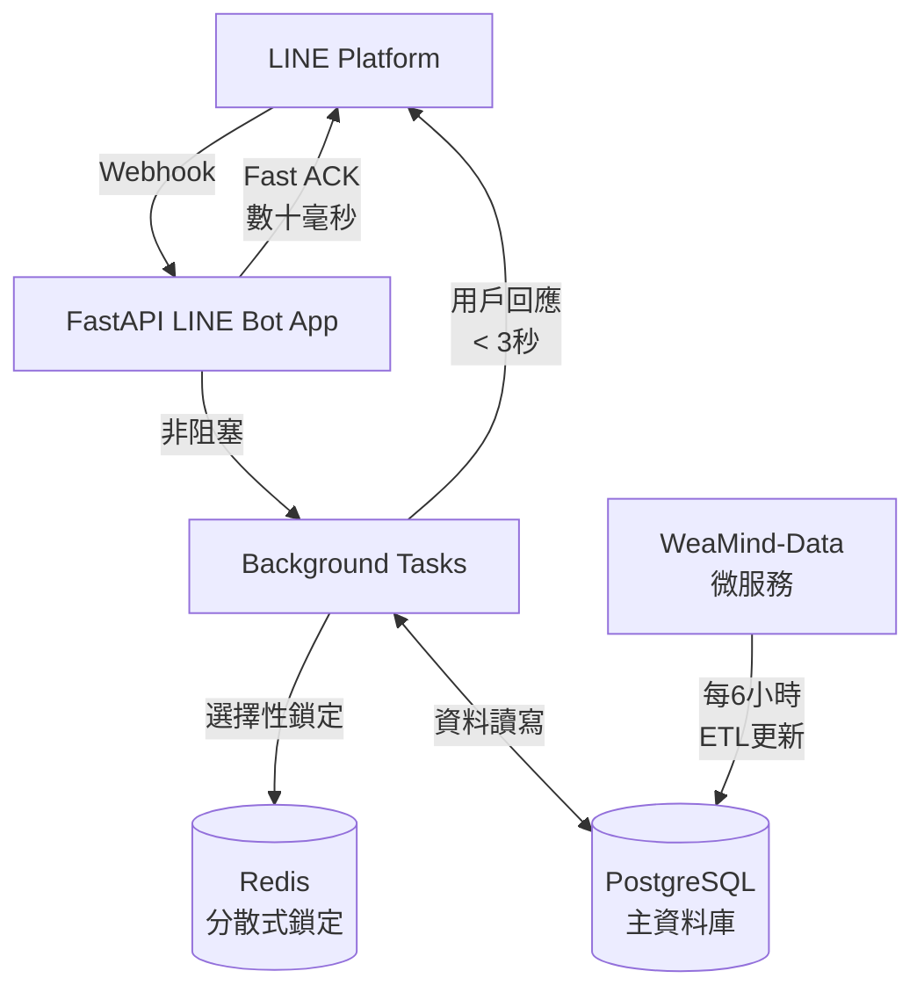

# README Enhancement Session Summary
*Generated: 2025-10-07*

## 任務完成摘要

### 🎯 主要目標
在 WeaMind README.md 中加入開發者技術亮點章節，展示專案的技術實力吸引開發者，同時不影響一般使用者的閱讀體驗。

### ✅ 完成項目

#### 1. 開發者技術亮點章節設計
- **位置**：放在使用者內容和 QR Code 之後，保持曝光度
- **策略**：中文撰寫，技術深度 3-4 級，避免宣傳式語言
- **內容來源**：基於 DeepWiki 深度調研 + Architecture-Code.md

#### 2. Mermaid 架構圖

#### 3. 技術亮點章節結構
- 🚀 Fast ACK Webhook 架構
- 🔒 Redis 分散式鎖
- 🗺️ 智慧位置解析引擎
- 🏗️ Domain-Driven Design 架構
- 🛠️ 現代化開發工具鏈
- 🔄 完整 CI 流水線
- 📦 容器化與部署

#### 4. 台灣用詞在地化
- ❌ "響應" → ✅ "回應"
- ❌ "併發控制" → ✅ "並行控制"

#### 5. CI/CD 章節強化
基於實際 `.github/workflows/` 檔案分析：
- 雙軌 GitHub Actions (ci.yml + codeql.yml)
- 完整品質檢查鏈 (Ruff → Pyright → Bandit → pip-audit → pytest)
- Dependabot 自動更新
- 自動化發布機制

### 🔍 技術調研發現

#### DeepWiki 關鍵技術亮點
1. **Fast ACK 架構**：LINE webhook 3 秒內回應，背景處理業務邏輯
2. **Redis 分散式鎖**：固定 TTL 設計、Fail-Open 策略、選擇性鎖定
3. **智慧位置解析**：四層搜尋策略、地址優先+GPS備援
4. **完整型別安全**：全專案 type hints 覆蓋
5. **現代化工具鏈**：uv + ruff + pyright

#### 架構設計特色
- DDD 模組化：clear 領域邊界分離
- 微服務架構：WeaMind-Data 獨立 ETL 服務
- 容器化部署：多環境 Docker Compose

---

## FOR AI: Memory Hooks 🧠

### 🎪 專案背景 Context
- **WeaMind**: 台灣天氣 LINE Bot，解決查詢「非預設區域」天氣的痛點
- **技術棧**: FastAPI + PostgreSQL + Redis + LINE Bot SDK v3
- **部署**: Docker + uv 套件管理
- **特色**: Fast ACK 架構是最大創新亮點

### 🎯 設計原則 & 使用者偏好
- **中文優先**: 專案使用中文，注意台灣用詞 vs 中國大陸用詞
- **實務導向**: 避免宣傳式語言，強調具體實作與技術細節
- **曝光度重視**: README 主頁 > 獨立頁面，因此選擇直接加入而非連結
- **技術深度**: 3-4 級技術細節，既吸引開發者又不過於冗長

### 🔧 重要檔案參考
- `docs/Architecture-Code.md`: 最新詳細架構文件 (優於 Architecture.md)
- `.github/workflows/`: 實際 CI/CD 實作，比文件描述更準確
- DeepWiki: `https://deepwiki.com/kyomind/WeaMind` 有完整技術分析

### 🎨 Visual & Style Guide
- **Emoji 使用**: 每個章節都有對應 emoji，注意顯示正確性
- **Mermaid 偏好**: High-level 元件圖 > 詳細流程圖
- **Markdown 結構**: 使用 `---` 分隔線區分章節

### ⚠️ 注意事項
- **用詞敏感**: "響應"→"回應", "併發"→"並行"
- **不重複 badges**: README 頂部已有，避免重複引用
- **Architecture.md**: 是早期文件，優先引用 Architecture-Code.md
- **微服務架構**: WeaMind-Data 是獨立微服務，每6小時 ETL

### 🚀 下次可能的改進方向
- 效能監控與可觀測性增強
- API 文件自動化
- 測試策略優化
- 安全性進一步強化

---

*本文件記錄了 2025-10-07 README 增強的完整過程，供未來參考。*
