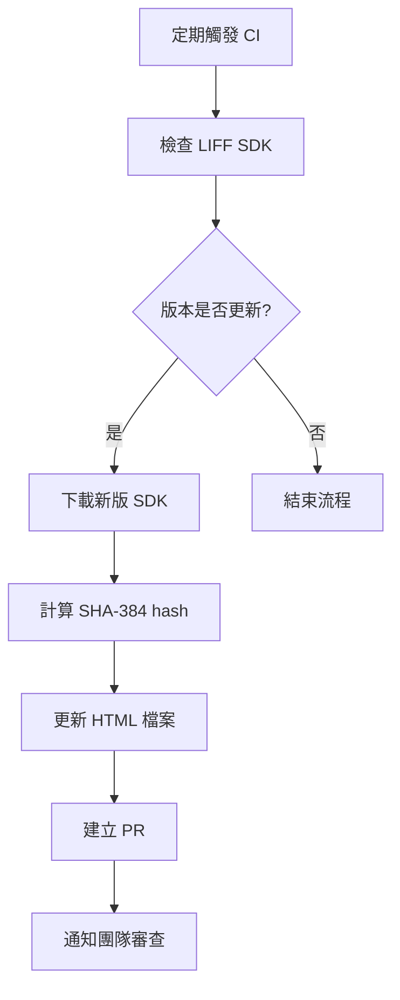

# LIFF SDK Integrity 自動化檢查與更新機制

## 專案概述

實作自動化機制在 CI/CD 流程中定期檢查 LINE LIFF SDK 版本並自動更新 integrity hash，以平衡安全性與維護成本。

## 背景與動機

### 當前狀況
- LIFF SDK 載入時移除了 `integrity` 屬性以避免 LINE 更新 SDK 時導致載入失敗
- SonarCloud 標記為安全風險（Web:S5725）
- 手動維護 integrity hash 成本高且容易出錯

### 目標
- 恢復 `integrity` 屬性的安全保護
- 自動化處理 SDK 更新
- 減少維護負擔
- 提升供應鏈安全性

## 技術架構

### 自動化流程


### 核心組件

#### 1. SDK 檢查腳本
```bash
#!/bin/bash
# scripts/check_liff_sdk.sh

SDK_URL="https://static.line-scdn.net/liff/edge/2/sdk.js"
CURRENT_HASH=$(grep -o 'integrity="sha384-[^"]*"' static/liff/location/index.html | cut -d'"' -f2)

# 下載當前 SDK 並計算 hash
REMOTE_HASH="sha384-$(curl -s $SDK_URL | openssl dgst -sha384 -binary | openssl base64 -A)"

if [ "$CURRENT_HASH" != "$REMOTE_HASH" ]; then
    echo "SDK updated: $CURRENT_HASH -> $REMOTE_HASH"
    exit 1
else
    echo "SDK hash is current"
    exit 0
fi
```

#### 2. GitHub Actions Workflow
```yaml
# .github/workflows/liff-sdk-integrity-check.yml
name: LIFF SDK Integrity Check

on:
  schedule:
    - cron: '0 9 * * 1'  # 每週一 09:00 UTC
  workflow_dispatch:

jobs:
  check-sdk:
    runs-on: ubuntu-latest
    steps:
      - uses: actions/checkout@v4

      - name: Check LIFF SDK integrity
        id: check
        run: |
          chmod +x scripts/check_liff_sdk.sh
          if ! scripts/check_liff_sdk.sh; then
            echo "update_needed=true" >> $GITHUB_OUTPUT
          fi

      - name: Update integrity hash
        if: steps.check.outputs.update_needed == 'true'
        run: scripts/update_liff_integrity.sh

      - name: Create Pull Request
        if: steps.check.outputs.update_needed == 'true'
        uses: peter-evans/create-pull-request@v5
        with:
          token: ${{ secrets.GITHUB_TOKEN }}
          commit-message: "chore: update LIFF SDK integrity hash"
          title: "🔒 Update LIFF SDK integrity hash"
          body: |
            Auto-generated PR to update LIFF SDK integrity hash.

            LINE has updated their LIFF SDK, this PR updates the integrity
            attribute to maintain security while ensuring compatibility.
          branch: chore/update-liff-sdk-integrity
```

#### 3. Hash 更新腳本
```bash
#!/bin/bash
# scripts/update_liff_integrity.sh

SDK_URL="https://static.line-scdn.net/liff/edge/2/sdk.js"
HTML_FILE="static/liff/location/index.html"

# 計算新的 integrity hash
NEW_HASH="sha384-$(curl -s $SDK_URL | openssl dgst -sha384 -binary | openssl base64 -A)"

# 更新 HTML 檔案
sed -i "s/integrity=\"sha384-[^\"]*\"/integrity=\"$NEW_HASH\"/" $HTML_FILE

echo "Updated integrity hash to: $NEW_HASH"
```

## 實作階段

### Phase 1: 基礎設施建置
- [ ] 建立檢查腳本
- [ ] 設定 GitHub Actions workflow
- [ ] 測試自動化流程

### Phase 2: 整合與優化
- [ ] 整合到現有 CI/CD 流程
- [ ] 新增通知機制
- [ ] 錯誤處理與 fallback 機制

### Phase 3: 監控與維護
- [ ] 設定監控指標
- [ ] 建立 SLA 目標
- [ ] 文件化操作流程

## 安全性考量

### 風險評估
- **供應鏈攻擊**: 自動下載可能被攻擊的 SDK
- **自動化風險**: CI 自動建立 PR 可能引入惡意變更
- **權限管理**: GitHub token 權限範圍

### 緩解措施
- 限制自動化 PR 只能更新特定檔案
- 需要人工審查才能合併
- 使用最小權限原則
- 新增驗證步驟確認 SDK 來源

## 維護與監控

### 監控指標
- SDK 檢查成功率
- 自動 PR 建立頻率
- 人工審查時間
- 錯誤率統計

### 警報設定
- SDK 檢查失敗
- 連續多次更新失敗
- 異常的更新頻率

## 預期效益

### 安全性提升
- ✅ 恢復 integrity 保護
- ✅ 自動化供應鏈監控
- ✅ 減少人為錯誤

### 維護效率
- ✅ 自動化處理更新
- ✅ 減少手動維護工作
- ✅ 標準化更新流程

### 合規性
- ✅ 滿足 SonarCloud 安全要求
- ✅ 符合最佳實務標準
- ✅ 可審計的更新記錄

## 技術債務清理

實作完成後可以：
- 移除當前的 integrity 移除註釋
- 更新安全文件
- 關閉 SonarCloud 相關 issue

## 估算工作量

- **設計與規劃**: 4-6 小時
- **腳本開發**: 8-12 小時
- **CI/CD 整合**: 6-8 小時
- **測試與調優**: 4-6 小時
- **文件撰寫**: 2-4 小時

**總計**: 24-36 小時（約 3-5 個工作天）

## 參考資料

- [Subresource Integrity - MDN](https://developer.mozilla.org/en-US/docs/Web/Security/Subresource_Integrity)
- [GitHub Actions Security](https://docs.github.com/en/actions/security-guides)
- [SonarCloud Web:S5725 規則](https://rules.sonarsource.com/javascript/RSPEC-5725)
- [LINE LIFF SDK Documentation](https://developers.line.biz/en/docs/liff/)
