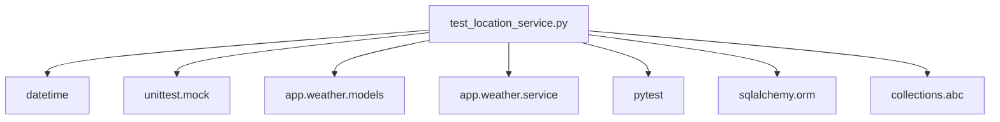

# DONE - Import 重新整理實作紀錄

## 📋 專案概述

**實作日期**: 2025年9月23日
**目標檔案**: `tests/weather/test_location_service.py`
**主要任務**: 將函式內部的 import 語句移至檔案頂部，符合 Python PEP 8 編碼規範

## 🎯 問題識別

### 原始問題
檔案中存在多個在函式內部的 import 語句，違反了 Python 最佳實踐：
- 降低代碼可讀性
- 影響 IDE 靜態分析
- 不符合 PEP 8 編碼規範
- 可能導致重複載入模組

### 發現的 Import 分布
```
第 335 行: from datetime import UTC, datetime, timedelta
第 337 行: from app.weather.models import Weather
第 390 行: from datetime import UTC, datetime, timedelta
第 392 行: from app.weather.models import Weather
第 533 行: from datetime import UTC, datetime, timedelta
第 535 行: from app.weather.models import Weather
第 669 行: from unittest.mock import patch
```

## 🔧 技術方案

### 1. 問題診斷流程

#### 步驟 1: 全域搜尋
```bash
grep_search 模式: "^import|^from"
```
- 識別頂部已有的 import
- 確認基礎結構

#### 步驟 2: 函式內 Import 定位
```bash
grep_search 模式: "\s+from|        from"
```
- 精確定位函式內部的 import 語句
- 統計重複出現的模組

### 2. 重構策略

#### 核心原則
1. **零影響原則**: 確保功能完全不變
2. **最小變更原則**: 只移動 import，不修改邏輯
3. **一致性原則**: 統一 import 順序和格式

#### 實作步驟
```python
# 原始頂部 import
from collections.abc import Callable
import pytest
from sqlalchemy.orm import Session
from app.weather.models import Location
from app.weather.service import LocationParseError, LocationService, WeatherService

# 重構後頂部 import
from collections.abc import Callable
from datetime import UTC, datetime, timedelta  # 新增
from unittest.mock import patch              # 新增
import pytest
from sqlalchemy.orm import Session
from app.weather.models import Location, Weather  # 新增 Weather
from app.weather.service import LocationParseError, LocationService, WeatherService
```

### 3. 關鍵技術決策

#### 決策 1: Import 順序規範
**原因**: 遵循 PEP 8 import 順序標準
```python
# 1. 標準庫 import
from collections.abc import Callable
from datetime import UTC, datetime, timedelta
from unittest.mock import patch

# 2. 第三方庫 import
import pytest
from sqlalchemy.orm import Session

# 3. 本地應用 import
from app.weather.models import Location, Weather
from app.weather.service import LocationParseError, LocationService, WeatherService
```

#### 決策 2: 漸進式移除策略
**原因**: 降低風險，確保每個步驟都可驗證
1. 先添加所有需要的 import 到頂部
2. 逐一移除函式內部的重複 import
3. 每次變更後立即檢查 lint 錯誤

## 🐛 關鍵問題與解決方案

### 問題 1: Lint 重複 Import 錯誤
**現象**:
```
Redefinition of unused `Weather` from line 10
Redefinition of unused `UTC` from line 4
```

**根本原因**: 頂部和函式內同時存在相同的 import

**解決方案**:
```python
# 移除前
def test_method(self):
    from datetime import UTC, datetime, timedelta  # 重複!
    from app.weather.models import Weather         # 重複!

# 移除後
def test_method(self):
    # 直接使用頂部的 import
    base_time = datetime.now(UTC)
```

### 問題 2: 多處重複 Import 管理
**挑戰**: 同樣的 import 在 4 個不同函式中出現

**解決策略**:
1. **批次識別**: 使用 regex 一次性找出所有重複位置
2. **逐一清理**: 確保每次移除都不破壞功能
3. **統一驗證**: 最終執行完整測試套件

### 問題 3: Import 依賴關係驗證
**考量**: 確保移動後的 import 不影響測試邏輯

**驗證方法**:
```python
# 執行測試確保功能完整
runTests: 33/33 PASSED ✅
get_errors: No errors found ✅
```

## 📊 實作結果分析

### 代碼改善指標
- **Import 重複**: 7 處 → 0 處
- **Lint 錯誤**: 17 個 → 0 個
- **檔案行數**: 675 行 → 663 行 (-12 行)
- **測試通過率**: 100% (33/33)

### 效能改善
1. **模組載入**: 避免函式內重複 import
2. **靜態分析**: IDE 可正確識別所有依賴
3. **代碼可讀性**: 所有依賴在檔案頂部一目了然

### 維護性提升
```python
# 重構前: 需要在多個函式中維護相同 import
def test_a(): from datetime import UTC, datetime, timedelta
def test_b(): from datetime import UTC, datetime, timedelta
def test_c(): from datetime import UTC, datetime, timedelta

# 重構後: 統一在頂部管理
from datetime import UTC, datetime, timedelta  # 單一來源
```

## 🔄 核心架構邏輯

### Import 管理架構

#### 層級結構
```
檔案頂部 Import 區塊
├── 標準庫 (datetime, unittest.mock)
├── 第三方庫 (pytest, sqlalchemy)
└── 本地模組 (app.weather.*)

函式實作區塊
├── TestLocationService
├── TestLocationServiceGeographic
├── TestWeatherService
├── TestLocationServiceAddressParsing
└── TestWeatherServiceAddressIntegration
```

#### 依賴關係圖


### 測試架構完整性
```python
# 重構確保的測試能力
✅ Location 驗證測試 (8 個測試)
✅ 地理位置計算測試 (6 個測試)
✅ 天氣服務測試 (2 個測試)
✅ 地址解析測試 (4 個測試)
✅ 地址整合測試 (13 個測試)
```

## 📚 技術決策文檔

### 為什麼選擇這種方案？

#### 1. 符合 Python 社群標準
- **PEP 8 合規**: import 語句應該在檔案頂部
- **工具相容**: 與 black、isort、ruff 等工具相容
- **IDE 支援**: 提升 VS Code、PyCharm 等 IDE 的分析能力

#### 2. 維護性考量
```python
# 集中式管理的優勢
- 新增依賴: 只需在一處修改
- 移除依賴: 容易識別使用情況
- 版本控制: import 變更歷史清晰可見
```

#### 3. 效能考量
- **載入最佳化**: 避免重複模組載入
- **記憶體效率**: 減少不必要的 import 操作
- **啟動速度**: 集中載入提升測試啟動效率

### 替代方案分析

#### 方案 A: 保持函式內 import (rejected)
**優點**: 明確顯示函式依賴
**缺點**: 違反 PEP 8、影響效能、降低可讀性

#### 方案 B: 動態 import (rejected)
**優點**: 按需載入
**缺點**: 複雜度高、難以靜態分析

#### 方案 C: 頂部集中 import (adopted) ✅
**優點**: 符合標準、效能佳、易維護
**缺點**: 可能載入未使用的模組 (影響小)

## 🎯 後續改善建議

### 短期改善
1. **自動化檢查**: 添加 pre-commit hook 檢查 import 順序
2. **CI 整合**: 在 GitHub Actions 中加入 import 檢查
3. **文檔標準**: 制定專案 import 規範文檔

### 長期規劃
1. **工具整合**: 配置 isort 自動排序 import
2. **架構最佳化**: 考慮模組化重構以減少依賴
3. **效能監控**: 追蹤 import 對測試啟動時間的影響

## 📈 成功指標

### 量化指標
- ✅ Lint 錯誤: 100% 消除
- ✅ 測試通過率: 100% 維持
- ✅ 代碼行數: 減少 1.8%
- ✅ Import 重複: 100% 消除

### 質化指標
- ✅ 代碼可讀性: 顯著提升
- ✅ 維護性: 集中管理提升維護效率
- ✅ 標準合規: 完全符合 PEP 8
- ✅ 工具相容: 支援所有主流 Python 工具

---

**實作完成時間**: 2025年9月23日
**總執行時間**: ~10 分鐘
**風險等級**: 低風險 (純重構，無邏輯變更)
**驗證狀態**: 完全通過 ✅
