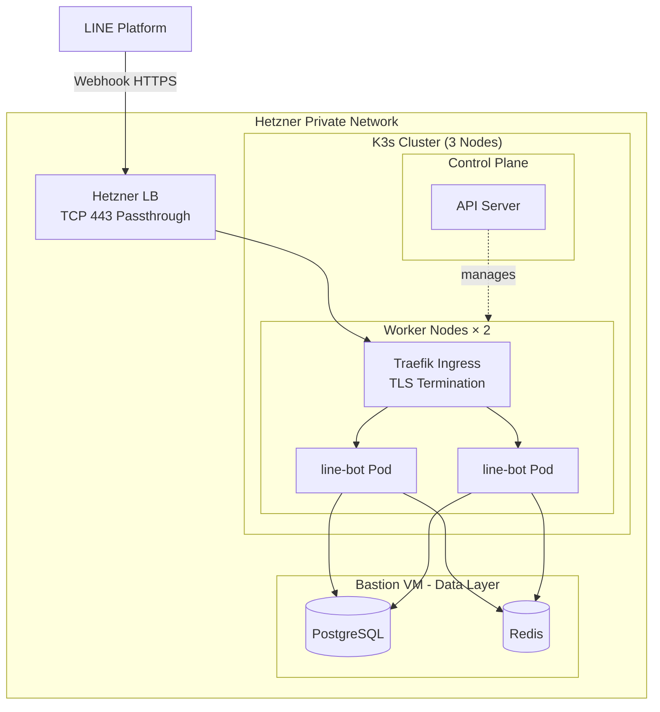

# WeaMind Infrastructure

> 📖 [中文版](README.md)

Kubernetes infrastructure for [WeaMind](https://github.com/kyomind/weamind) — demonstrating a migration from a single-server Docker Compose setup to a K8s cluster.

> Main application: [WeaMind](https://github.com/kyomind/weamind) — LINE Bot built with FastAPI

## Architecture

**Architecture highlights**:
- **Hybrid approach**: Application layer on K8s, data layer on the bastion VM (stability first, avoiding StatefulSet complexity)
- **Dual-environment**: K8s (`k8s.kyomind.tw`) and single-server (`api.kyomind.tw`) run in parallel; traffic is switched by updating the LINE webhook URL (takes effect in seconds, no DNS propagation delay)

## Tech Stack

- **K3s** cluster (1 control plane + 2 worker nodes) on Hetzner Cloud
- **Traefik** Ingress Controller (bundled with K3s)
- **Hetzner Load Balancer**
- **cert-manager** + Let's Encrypt (Cloudflare DNS-01 challenge)
- **PostgreSQL** and **Redis** on the bastion VM (outside K8s)

## Deployment Overview

1. **K3s cluster setup**: Install K3s server on the control plane; workers join via node-token
2. **Network configuration**: Bind to the private network interface (`--node-ip` + `--flannel-iface`) to avoid using the public IP
3. **Traefik configuration**: Ensure the built-in Ingress Controller binds to the private network
4. **cert-manager installation**: Deploy cert-manager + ClusterIssuer (Cloudflare DNS-01)
5. **Application deployment**: Apply YAMLs in `manifests/` in order — Namespace → ConfigMap → Secret → Deployment → Service → Ingress
6. **Load balancer configuration**: Hetzner LB — TCP 443 forwarding + health check
7. **DNS setup**: Cloudflare A record `k8s.kyomind.tw` pointing to the LB public IP
8. **Traffic switch**: Update LINE Developers webhook URL from `api.kyomind.tw` to `k8s.kyomind.tw`

For detailed implementation progress and lessons learned, see [PROGRESS.md](PROGRESS.md).

## Design Decisions

### K3s over kubeadm

Single binary, built-in Traefik, CNCF-certified. For a small cluster maintained by a single person, it's the most pragmatic choice.

### Data layer on VM

PostgreSQL and Redis connect to the K8s cluster over a private network. Keeping the data layer on a VM prioritizes stability and avoids the operational overhead of StatefulSets.

### cert-manager + DNS-01

Hetzner's managed certificates don't support Cloudflare DNS, so cert-manager with DNS-01 validation is used instead. The LB handles TCP 443 passthrough only; TLS termination happens at Traefik.

### LINE Webhook URL switching

Takes effect in seconds with no DNS propagation delay. K8s and single-server environments can run in parallel, making testing and rollback straightforward.

## Related Resources

- **Main application**: [WeaMind](https://github.com/kyomind/weamind) — LINE Bot FastAPI application
- **DeepWiki docs**: [deepwiki.com/kyomind/weamind-infra](https://deepwiki.com/kyomind/weamind-infra)
