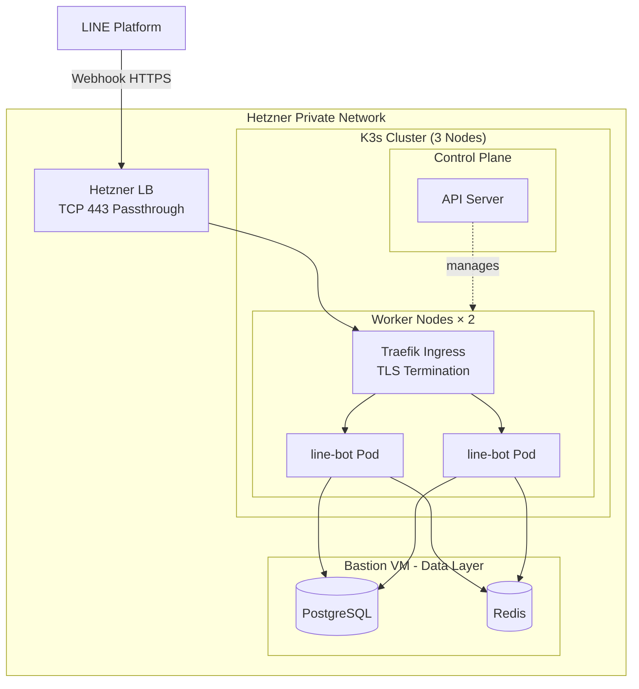

# WeaMind Infrastructure

> 📖 [English Version](README.en.md)

WeaMind 的 Kubernetes 基礎設施 — 展示從單機 Docker 到 K8s 叢集的遷移實踐。

> 主應用程式：[WeaMind](https://github.com/kyomind/weamind) - LINE Bot FastAPI application

## Architecture

**架構特點**：
- **混合架構**：應用層在 K8s，資料層保留在堡壘機（穩定性優先，避免 StatefulSet 複雜度）。
- **雙環境並行**：K8s (`k8s.kyomind.tw`) 與單機 (`api.kyomind.tw`) 獨立運行，透過 LINE webhook URL 切換（秒級生效，無 DNS 傳播延遲）。

## Tech Stack

- **K3s** 叢集（1 控制平面 + 2 工作節點）於 Hetzner Cloud
- **Traefik** Ingress Controller（K3s 內建）
- **Hetzner Load Balancer** 負載平衡器
- **cert-manager** + Let's Encrypt（Cloudflare DNS-01 驗證）
- **PostgreSQL** 與 **Redis** 於堡壘機（不在 K8s 內）

## Deployment Overview

1. **K3s 叢集建立**：control-plane 安裝 K3s server，workers 使用 node-token 加入。
2. **網路配置**：強制綁定私有網路介面 (`--node-ip` + `--flannel-iface`)，避免誤抓公網 IP。
3. **Traefik 設定**：確保內建 Ingress Controller 正確綁定私有網路。
4. **cert-manager 安裝**：部署 cert-manager + ClusterIssuer (Cloudflare DNS-01)。
5. **應用部署**：依序套用 `manifests/` 中的 YAML（Namespace → ConfigMap → Secret → Deployment → Service → Ingress）。
6. **負載平衡器配置**：Hetzner LB 設定 TCP 443 轉發 + 健康檢查。
7. **DNS 指向**：Cloudflare A record `k8s.kyomind.tw` 指向 LB 公網 IP。
8. **流量切換**：修改 LINE Developers webhook URL 從 `api.kyomind.tw` 切換到 `k8s.kyomind.tw`。

詳細實作進度與踩坑記錄請見 [PROGRESS.md](PROGRESS.md)。

## Why This Architecture

### K3s over kubeadm

單一二進位檔、內建 Traefik、CNCF 認證。對於單人維運的小型叢集，這是最務實的選擇。

### 資料層保留在 VM

PostgreSQL 與 Redis 透過內網連接 K8s 叢集。資料層穩定性優先，避免引入 StatefulSet 的管理複雜度。

### cert-manager + DNS-01

Hetzner 託管憑證不支援 Cloudflare DNS，改用 cert-manager 搭配 DNS-01 驗證。LB 只做 TCP 443 passthrough，TLS 終止在 Traefik。

### LINE Webhook URL 切換

秒級生效，無 DNS 傳播延遲。K8s 與單機環境可並行運行，方便測試與 rollback。

## Related Resources

- **主應用程式**：[WeaMind](https://github.com/kyomind/weamind) - LINE Bot FastAPI application
- **DeepWiki 技術文件**：[deepwiki.com/kyomind/weamind-infra](https://deepwiki.com/kyomind/weamind-infra)
- **專案介紹文章**：〈WeaMind 專案介紹：技術選型與架構〉（撰寫中）
