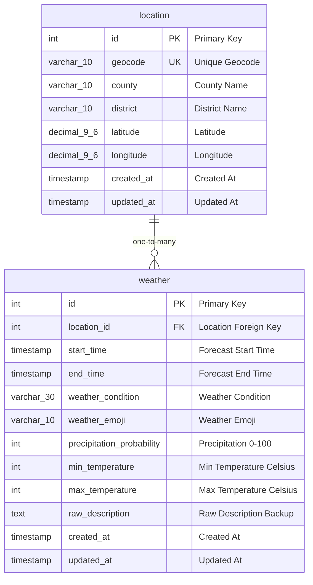
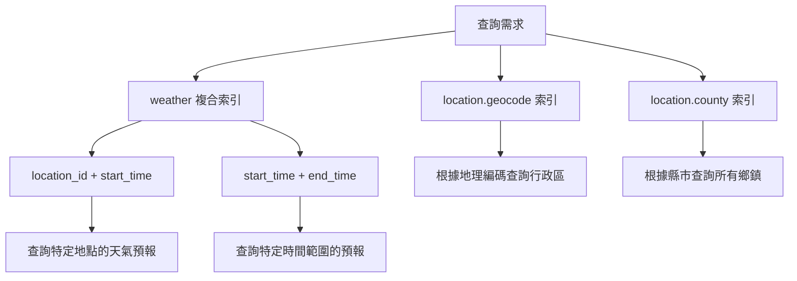
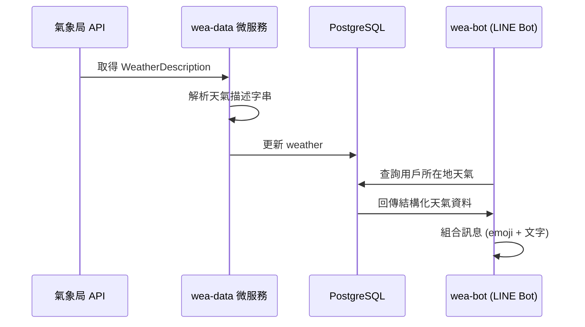

# WeaMind 資料庫 ERD (Entity Relationship Diagram)

建立日期: 2025-08-12  
描述: WeaMind 天氣與行政區資料庫的實體關係圖

## ERD 圖表

## 資料表關係說明

### 1. location (行政區)
- **用途**: 儲存台灣所有縣市鄉鎮的基本資訊
- **資料量**: 約 368 筆（全台灣行政區）
- **特色**: 相對靜態，需要初始化資料

### 2. weather (天氣預報)
- **用途**: 儲存各行政區的天氣預報資料
- **資料量**: 每日約 368 × 8 = 2,944 筆（每個行政區每天8個3小時區間）
- **特色**: 動態資料，由 wea-data 微服務定期更新

### 3. 關係說明
- **一對多關係**: 一個行政區對應多筆天氣預報記錄
- **外鍵約束**: weather.location_id → location.id
- **唯一約束**: 同一地點同一時間區間不可重複

## 索引策略

## 資料流程

## 備註

1. **時區**: 全部使用台灣時間 (+08:00)，無需時區轉換
2. **資料更新**: weather 採覆蓋式更新，保持最新預報
3. **備援機制**: raw_description 保留原始資料用於除錯和驗證
4. **emoji 映射**: 在應用層或資料庫觸發器中處理天氣狀況到 emoji 的映射
